# Hướng dẫn thiết lập môi trường cho Micropython trên hệ điều hành Windows
## 1. Tải những module quan trọng cho môi trường Micropython
```bash
pip install -r requirements.txt
```
> Nhớ dẫn tới thư mục chứa requirements.txt để kích hoạt
## 2. Thiết lập môi trường

### 2.1. Download file hoặc git clone về

```bash
git clone https://github.com/kimdamitung/Micropython
```

> Hoặc

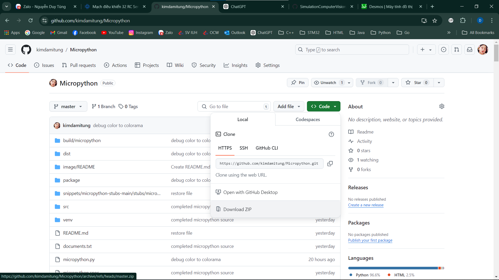

Sau khi download xong thì giải nén thông qua phần mền WinRAR nếu chưa có lo mà cài !!!

### 2.2. Add path cho micropython

Bước 1: Nút Window, search variables

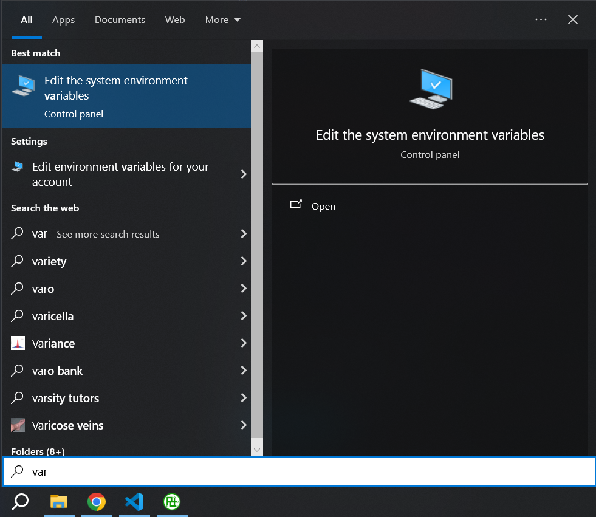

Bước 2: Cửa sổ xuất hiện

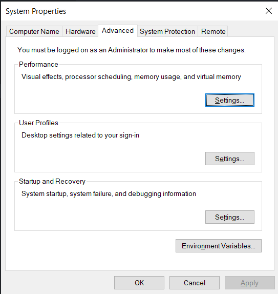

> Chọn Environments Variables...

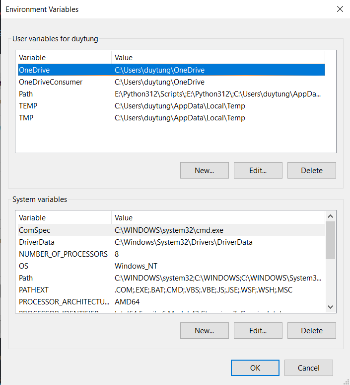

Bước 3: Trỏ con chuột vào path ở mục System variables, chọn Edit

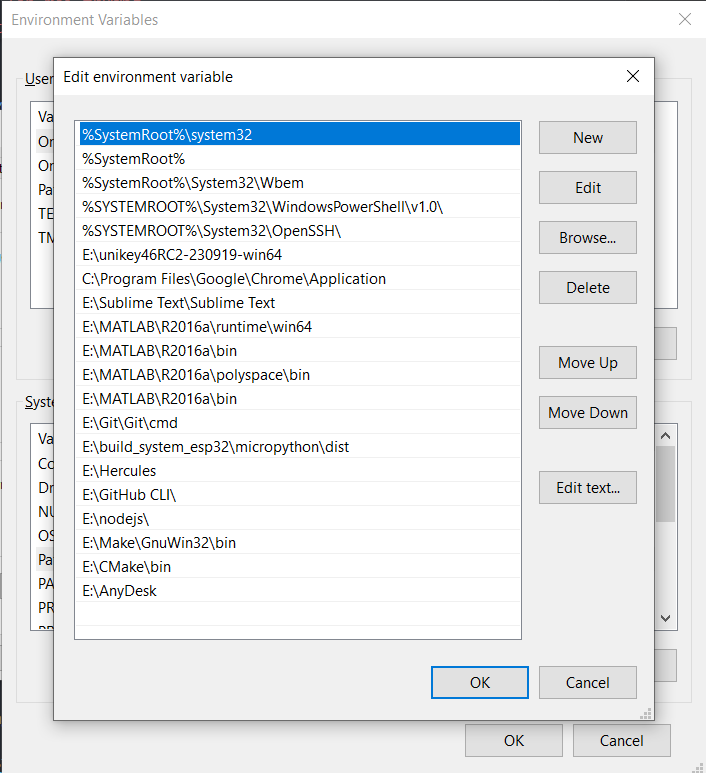

Bước 4: New > Micropython-master/dist

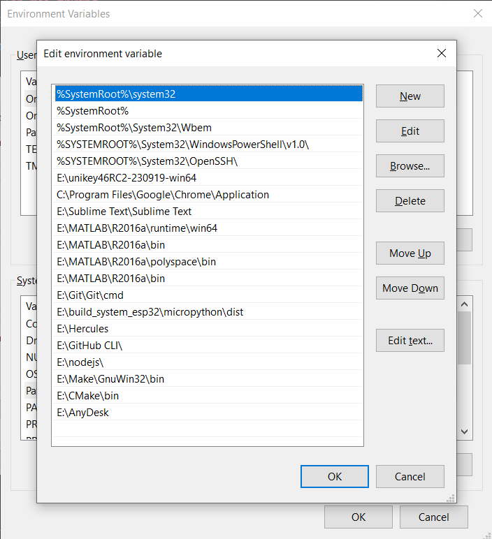

Bước 5: Ok mọi giao diện 

### 2.3. Kiểm thử môi trường micropython trên máy tính windows

Bước 1: Nút Windows, search cmd, chọn Command Prompt

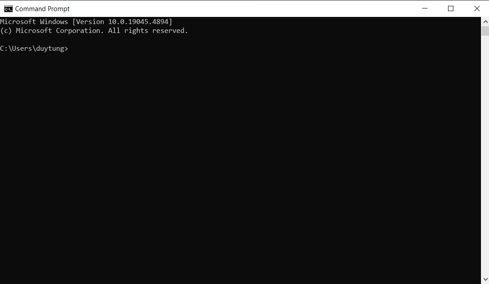

Bước 2: Gõ micropython và ấn Enter

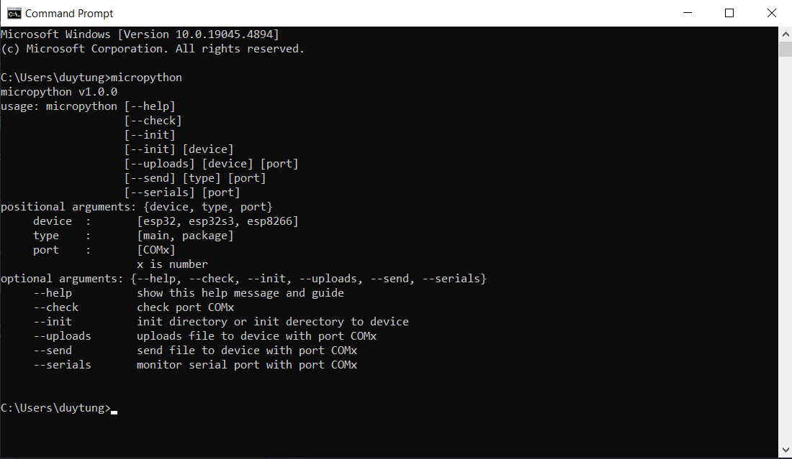

> Nếu hiện như vậy là đã chạy thành công, còn nếu kết quả như sau

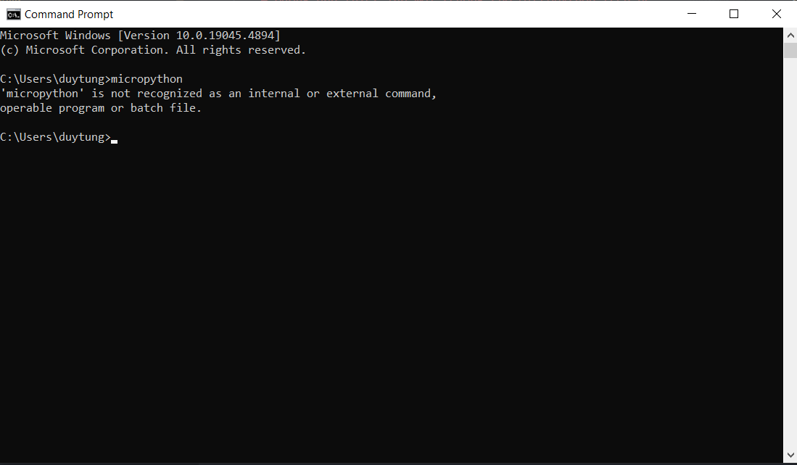

> Thì hảy thực hiện lại từ mục 2

## 3. Sử dụng Visual Studio Code để viết tạo chương trình micropython

### 3.1. Tải phần mền Visual Studio Code

> Tải bản Window để và cài đặt theo hướng dẫn từ hãng đã đề ra

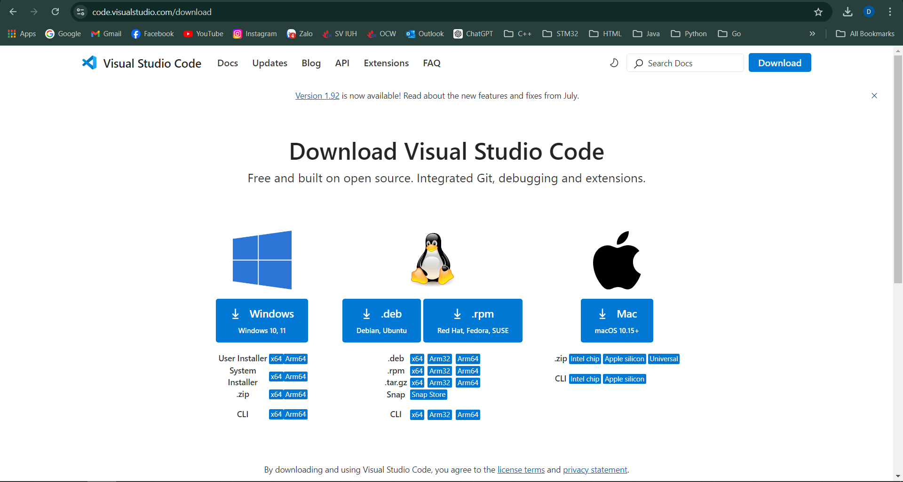

> Giao diện: vào Extensions (Ctrl + Shift + x) để mở

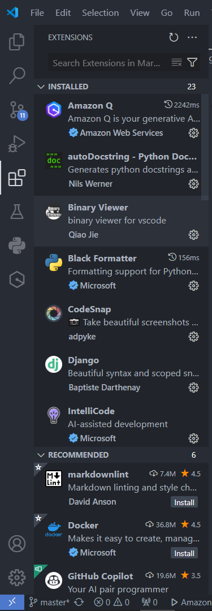

> Giao diện: gõ "python" vào thanh search và ấn Install

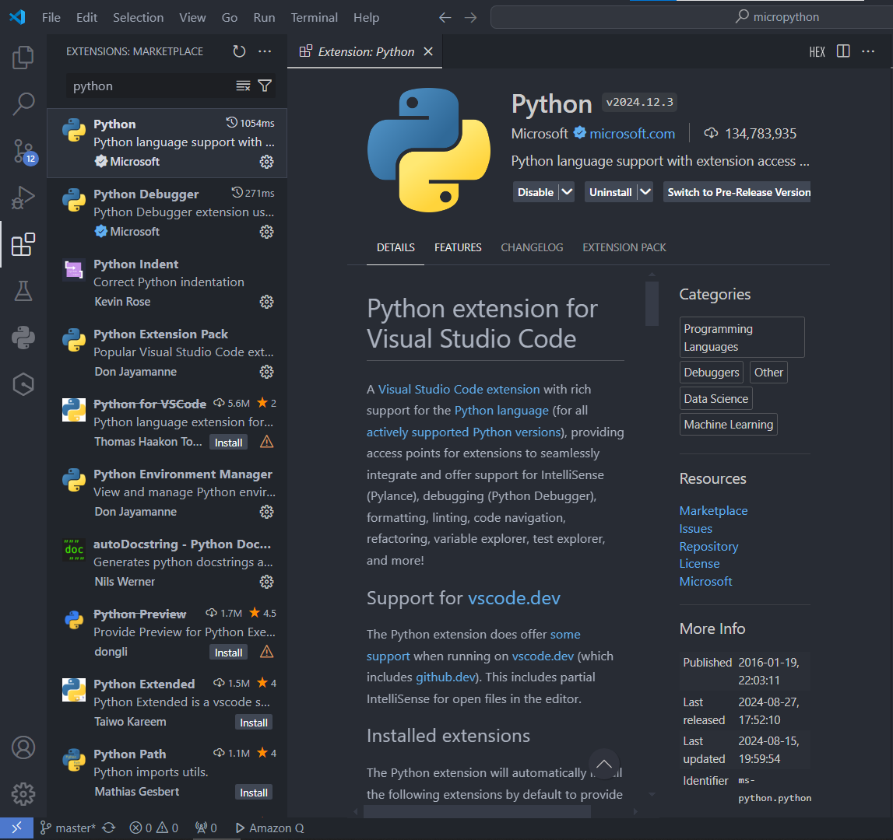

> Giao diện: tải python hoàn tất gõ Ctrl + Shift + p

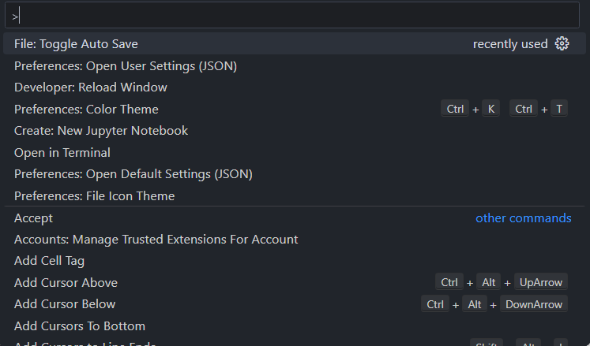

> Giao diện: tiếp tục gõ Open User Setting (JSON) và ấn Enter

```json
"python.autoComplete.extraPaths": [
    "Micropython-master/snippets/micropython-stubs-main/stubs/micropython-v1_20_0-esp32",
],
"python.analysis.extraPaths": [
    "Micropython-master/snippets/micropython-stubs-main/stubs/micropython-v1_20_0-esp32",
],
```

> Giao diện: đó là đường dẫn cục bộ, hãy thay thế nó thành đường dẫn ở máy tính của bạn