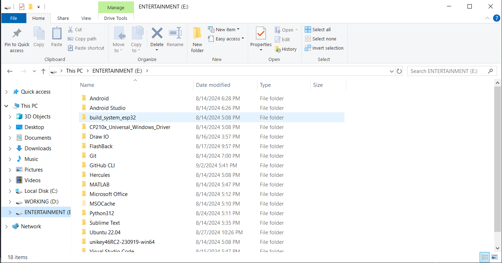
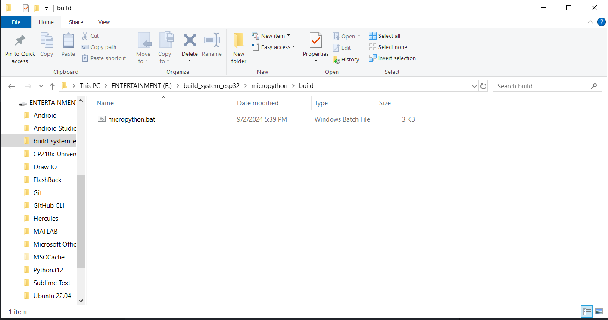
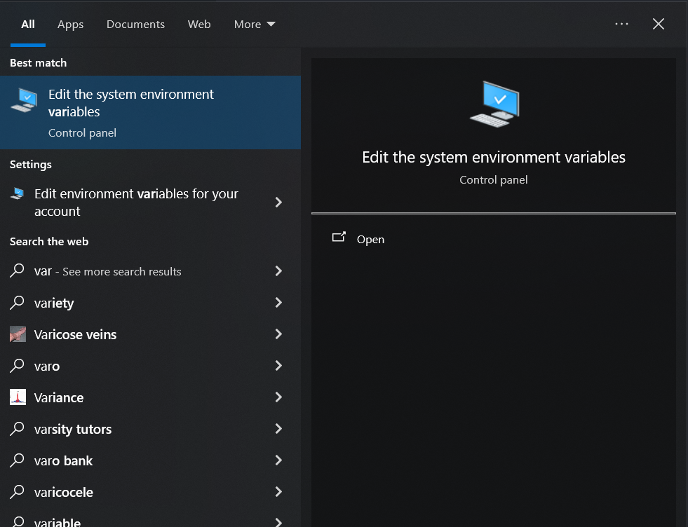
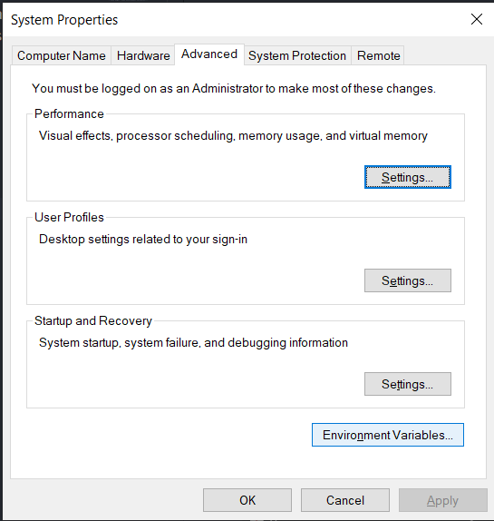
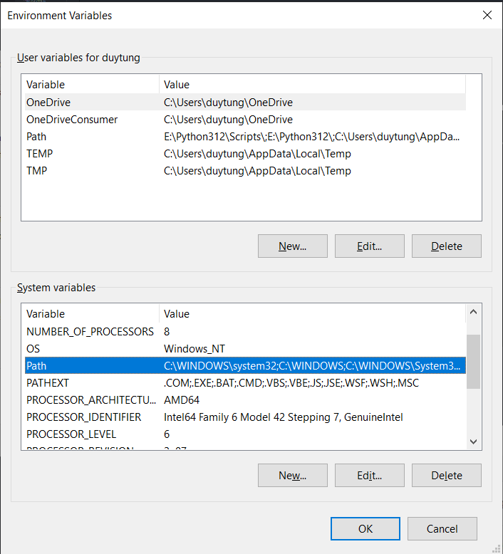
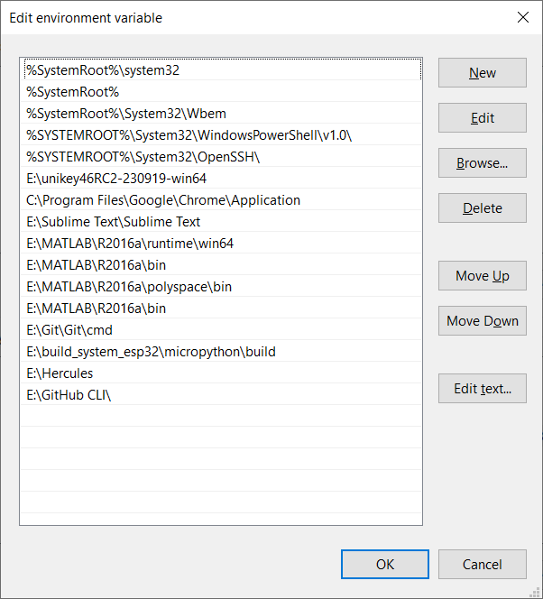
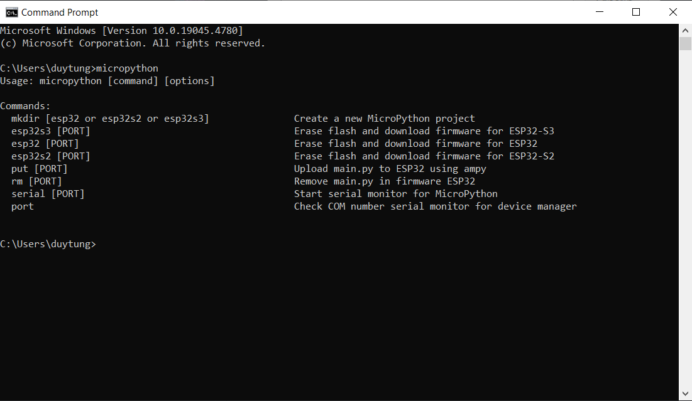

# Hướng dẫn thiết lập môi trường cho Micropython trên hệ điều hành Windows
## 1. Tải những module quan trọng cho môi trường Micropython
```bash
pip install -r requirements.txt
```
> Nhớ dẫn tới thư mục chứa requirements.txt để kích hoạt
## 2. Thiết lập môi trường
### 2.1. Lưu trữ môi trường
> Giải nén thì folder có tên Micropython-master


> Lưu môi trường vào một nơi bất kỳ trên ổ đĩa của máy tính
### 2.2. Chỉnh sửa file batch của môi trường
> Đường dẫn file batch: Micropython-master\build\micropython.bat



<span style = "font-size: 20px">Sử dụng bất kì editer nào để chỉnh sử file micropython.bat</span>

```bash
rem Tạo project MicroPython cho ESP32
if "%1" == "mkdir" (
    if "%2" == "esp32" (
        mkdir src && cd src && copy "E:\build_system_esp32\micropython\main\main.py" main.py && python E:/build_system_esp32/micropython/esp32.py && mkdir package && cd ..
    ) else if "%2" == "esp32s2" (
        mkdir src && cd src && copy "E:\build_system_esp32\micropython\main\main.py" main.py && python E:/build_system_esp32/micropython/esp32s2.py && mkdir package && cd ..
    ) else if "%2" == "esp32s3" (
        mkdir src && cd src && copy "E:\build_system_esp32\micropython\main\main.py" main.py && python E:/build_system_esp32/micropython/esp32s3.py && mkdir package && cd ..
    ) else (
        echo Invalid project type. Use esp32, esp32s2, or esp32s3.
    )
    goto eof
)
```

> Thay đổi dường dẫn E:/build_system_esp32/micropython/ bản gốc thành đường dẫn cụ thể của bạn

<span style = "font-size: 20px">Đường dẫn cụ thể chính xác là Micropython-master\ để dẫn tới file tạo project(thay thế E:/build_system_esp32/micropython/ bản gốc) và Micropython-master\main (thay thế E:\build_system_esp32\micropython\main\ bản gốc) tùy vào đường dẫn</span>

### 2.3. Thêm môi trường vào system 

<span style = "font-size: 20px">Copy đường dẫn chứa file micropython.bat đường dẫn có thể là Micropython-master\build (thay thế E:\build_system_esp32\micropython\build\ bản gốc)</span>

> Ấn nút Window trên phím tắt gõ variables



> Giao diện:  Chọn Environment Variables...



> Giao diện: System variables -> Path -> click chuột 2 lần



> Giao diện: Vào nút New or click 2 lần các khung trắng ngang để tạo path môi trường mới, gán đường dẫn tới file micropython.bat



> Giao diện: OK tất cả để hoàn tất

<span style = "font-size: 20px">Mở terminal (Command Prompt) để kiểm tra môi trường</span>

> Gõ micropython

```bash
micropython
```



> Nếu kết quả như hình ở trên thì cài môi trường thành công, còn nếu sai thì cài lại từ mục 2.3

## 3. Sử dụng Visual Studio Code để viết tạo chương trình micropython

### 3.1. Tải phần mền Visual Studio Code

> Tải bản Window để và cài đặt theo hướng dẫn từ hãng đã đề ra


> Giao diện: vào Extensions (Ctrl + Shift + x) để mở


> Giao diện: gõ "python" vào thanh search và ấn Install


> Giao diện: tải python hoàn tất gõ Ctrl + Shift + p


> Giao diện: tiếp tục gõ Open User Setting (JSON) và ấn Enter

```json
"python.autoComplete.extraPaths": [
    "Micropython-master/snippets/micropython-stubs-main/stubs/micropython-v1_20_0-esp32",
],
"python.analysis.extraPaths": [
    "Micropython-master/snippets/micropython-stubs-main/stubs/micropython-v1_20_0-esp32",
],
```

> Giao diện: đó là đường dẫn cục bộ, hãy thay thế nó thành đường dẫn ở máy tính của bạn