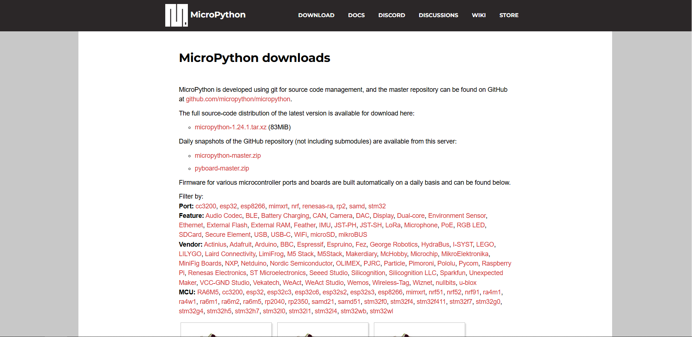
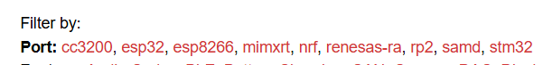
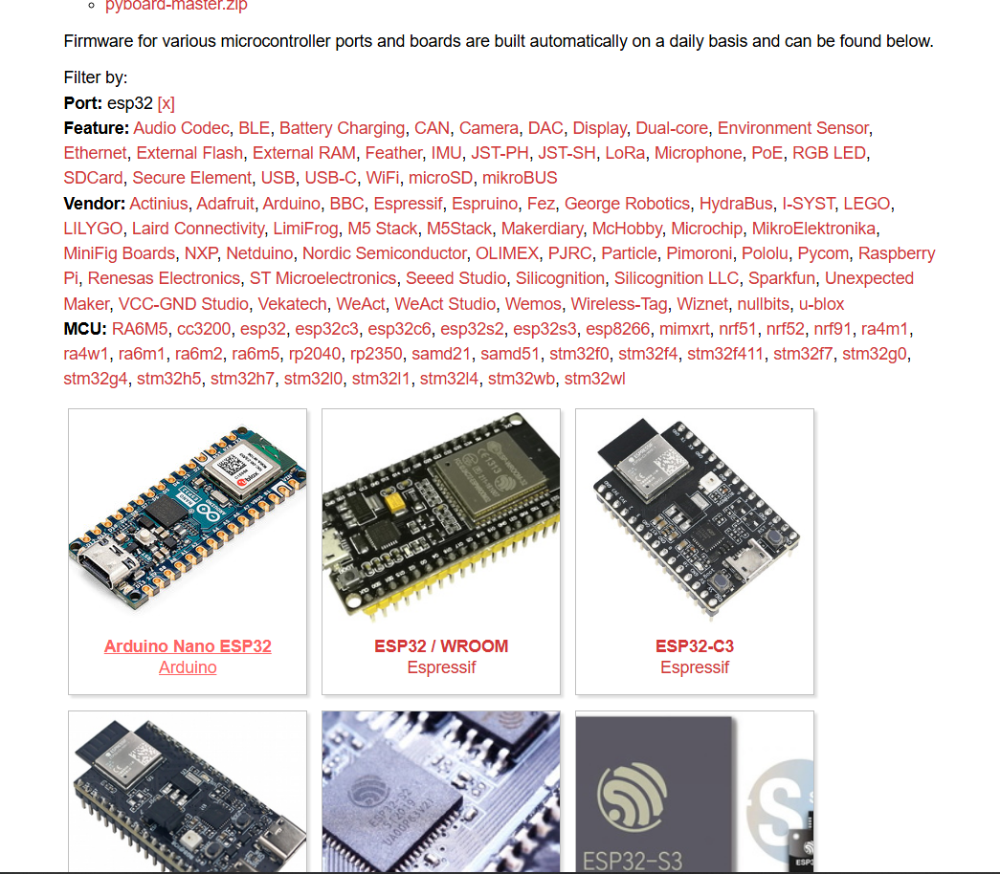
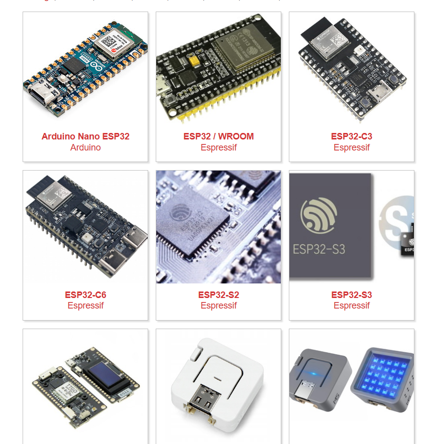
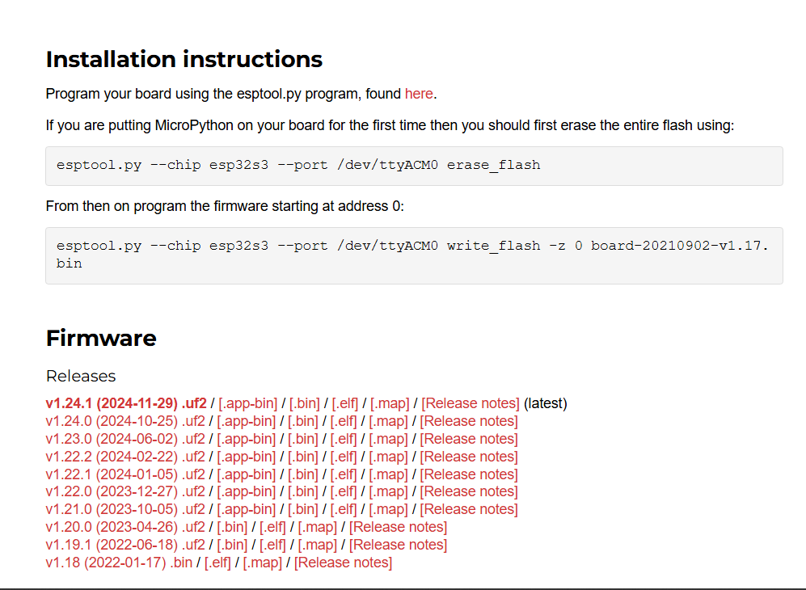
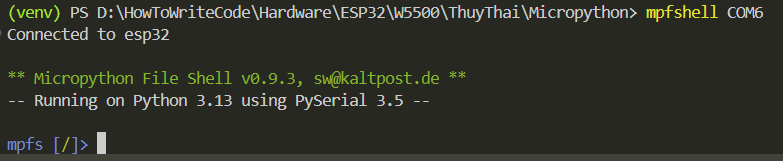

# Hướng dẫn thiết lập môi trường cho Micropython trên hệ điều hành Windows
## 1. Tải những module quan trọng cho môi trường Micropython
```bash
pip install -r requirements.txt
```
> Nhớ dẫn tới thư mục chứa requirements.txt để kích hoạt
## 2. Thiết lập môi trường

### 2.1. Download file hoặc git clone về

```bash
git clone https://github.com/kimdamitung/Micropython
```

> Hoặc


Sau khi download xong thì giải nén thông qua phần mền WinRAR nếu chưa có lo mà cài !!!

### 2.2. Add path cho micropython

Bước 1: Nút Window, search variables


Bước 2: Cửa sổ xuất hiện


> Chọn Environments Variables...


Bước 3: Trỏ con chuột vào path ở mục System variables, chọn Edit


Bước 4: New > Micropython-master/dist


Bước 5: Ok mọi giao diện 

### 2.3. Kiểm thử môi trường micropython trên máy tính windows

Bước 1: Nút Windows, search cmd, chọn Command Prompt


Bước 2: Gõ micropython và ấn Enter


> Nếu hiện như vậy là đã chạy thành công, còn nếu kết quả như sau


> Thì hảy thực hiện lại từ mục 2

## 3. Sử dụng Visual Studio Code để viết tạo chương trình micropython

### 3.1. Tải phần mền Visual Studio Code

> Tải bản Window để và cài đặt theo hướng dẫn từ hãng đã đề ra


> Giao diện: vào Extensions (Ctrl + Shift + x) để mở


> Giao diện: gõ "python" vào thanh search và ấn Install


> Giao diện: tải python hoàn tất gõ Ctrl + Shift + p


> Giao diện: tiếp tục gõ Open User Setting (JSON) và ấn Enter

```json
"python.autoComplete.extraPaths": [
    "Micropython-master/snippets/micropython-stubs-main/stubs/micropython-v1_20_0-esp32",
],
"python.analysis.extraPaths": [
    "Micropython-master/snippets/micropython-stubs-main/stubs/micropython-v1_20_0-esp32",
],
```

> Giao diện: đó là đường dẫn cục bộ, hãy thay thế nó thành đường dẫn ở máy tính của bạn


# Hướng dẫn cài môi trường trên command line interface

## Bước 1: Cài đăt SDK cho vi điều khiển (esp32, esp8266, rp2040, ...)

[Trang web download](https://micropython.org/download/)





> Click vào chọn dòng vi điều khiển



> Giả sử chọn dòng esp32, kéo xuống dưới hiện ra những loại chip 



> Chọn ESP32S3 làm ví dụ



> Làm theo hướng dẫn từ hãng trên website (còn không biết thì search gg đi)

## Bước 2: Cài thư viện cần thiết để giao tiếp với vi điều khiển

### 2.1: Cài python3 (mới nhất)

### 2.2: Cài các lib quan trọng

- Thư viện để flash vi điều khiển

```bash
pip install esptool
```

- Thư viện để đẩy file python qua vi điều khiển

```bash
pip install adafruit-ampy
```

- Ví dụ:

```bash
ampy -p COMx put main.py
```

- Thư viện để remote vào vi điều khiển

```bash
pip install mpfshell
```

- Ví dụ 

```bash
mpfshell COMx
```

> Chú ý: hiện tại khi cài và chạy mpfshell sẽ bị lỗi


- Cách khắc phục 

```bash
pip install telnetlib3
```


Vào `..\Lib\site-packages\mp\contelnet.py` để sửa 


Nhớ lưu



Như vậy là thành công